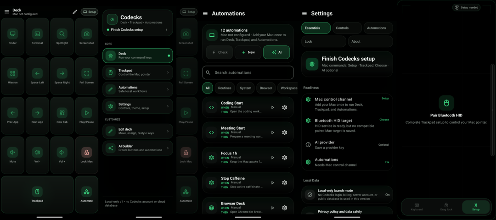

# Codecks

Codecks turns an Android phone, tablet, or Samsung DeX window into a customizable Mac control surface.



## Core product

- **Deck:** full-screen command keys for Finder, Terminal, Spaces, media, screenshots, and custom actions.
- **Trackpad:** Bluetooth HID pointer controls, gestures, scrolling, haptics, rotation, and optional Android screen pinning.
- **Automations:** local When / If / Then recipes with safe templates, test-before-enable, and run history.
- **Customization:** edit and reorder deck keys manually, or use an optional AI provider to draft buttons and automations.
- **DeX:** adaptive phone, tablet, landscape, freeform, and desktop layouts.

This first public release is **local-only**. Codecks has no account, hosted backend, public database, analytics SDK, or cloud sync. Optional AI requests go directly to the provider selected by the user. API keys are encrypted with Android Keystore and are never committed to this repository.

## Install

Download the signed APK and `SHA256SUMS.txt` from the [latest GitHub release](https://github.com/vaddisrinivas/codecks/releases/latest). Android may ask you to allow installation from your browser or file manager.

Requirements:

- Android 9 or newer.
- macOS with Remote Login enabled for Deck and Automations.
- A compatible paired Bluetooth host for HID Trackpad controls.

## Safety model

Codecks can run commands on a configured Mac. Built-in templates use an allowlist, dangerous shell patterns are blocked, generated automations stay disabled until reviewed and tested, and SSH host keys are pinned. Review every custom command before enabling it.

Local data can be deleted from **Android Settings → Apps → Codecks → Storage → Clear storage**, or by uninstalling the app. See [Privacy](PRIVACY.md) and [Security](SECURITY.md).

## Build

```bash
git clone https://github.com/vaddisrinivas/codecks.git
cd codecks
./gradlew :app:testDebugUnitTest :app:lintDebug :app:assembleDebug
```

Debug APK: `app/build/outputs/apk/debug/app-debug.apk`

Release signing instructions: [docs/release/RELEASING.md](docs/release/RELEASING.md).

## Project status

`v0.1.1` is a public beta with the AI Creator V2 structured-output pipeline and release workflow in place. Core flows work; broader device coverage, TalkBack validation, and longer crash-free field testing remain GA gates. See the [production launch plan](docs/release/PRODUCTION_LAUNCH_PLAN.md).

## License and attribution

Codecks is available under the [Apache License 2.0](LICENSE). Third-party Android libraries retain their own licenses; in-app notices are generated from `app/src/main/assets/open_source_notices.txt`.

Codecks is an independent project. It is not affiliated with OpenAI, Toggl, Work Louder, Samsung, Google, or Apple.
