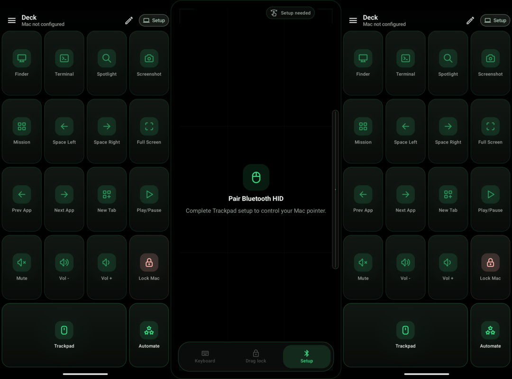
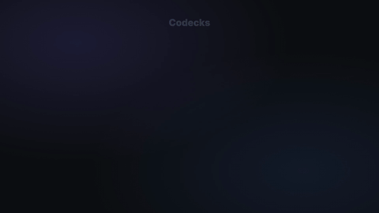

# Codecks

Turn an Android phone, tablet, or Samsung DeX window into a local-first command deck, trackpad, and automation surface for your Mac.

[](LICENSE)
[](app/build.gradle.kts)
[](app/build.gradle.kts)
[](PRIVACY.md)



## Demo



## Why It Exists

Mac shortcuts are fast until you need the command you never remember. Codecks gives you a second-screen control surface: big command keys, a Bluetooth trackpad, and reviewable automations that stay local by default.

## Highlights

- **Command deck:** Finder, Terminal, Spaces, media, screenshots, browser tabs, and custom Mac commands.
- **Trackpad:** Bluetooth HID pointer controls with gestures, scrolling, haptics, rotation, and optional screen pinning.
- **Automations:** local When / If / Then recipes with safe templates, test-before-enable, and run history.
- **AI-assisted drafting:** optional provider calls can draft buttons and automations; generated actions stay disabled until reviewed.
- **DeX-ready layouts:** phone, tablet, landscape, freeform, and desktop windows.
- **No hosted account:** no Codecks backend, analytics SDK, advertising SDK, public database, or cloud sync.

## Safety Model

Codecks can run commands on a Mac you configure, so the app is built around review and restraint:

- built-in templates use an allowlist;
- dangerous shell patterns are blocked;
- generated automations are disabled until the user tests and enables them;
- SSH host keys are pinned;
- optional AI API keys are encrypted with Android Keystore;
- diagnostic text is redacted before display.

Use a non-admin Mac account and review every custom command before enabling it. See [Security](SECURITY.md) and [Privacy](PRIVACY.md).

## Install

Download the signed APK and `SHA256SUMS.txt` from the [latest GitHub release](https://github.com/vaddisrinivas/codecks/releases/latest). Android may ask you to allow installation from your browser or file manager.

Requirements:

- Android 9 or newer.
- macOS with Remote Login enabled for Deck and Automations.
- A compatible paired Bluetooth host for HID Trackpad controls.

## Build

```bash
git clone https://github.com/vaddisrinivas/codecks.git
cd codecks
./gradlew :app:testDebugUnitTest :app:lintDebug :app:assembleDebug
```

Debug APK:

```text
app/build/outputs/apk/debug/app-debug.apk
```

Release signing instructions live in [docs/release/RELEASING.md](docs/release/RELEASING.md).

## Project Status

`v0.1.12` is the current public beta. Core deck, trackpad, keyboard, clipboard, automation, editing, settings, and optional AI-assisted drafting flows are implemented in the single signed APK. Broader physical-device coverage, TalkBack validation, and longer crash-free field testing remain GA gates. See the [production launch plan](docs/release/PRODUCTION_LAUNCH_PLAN.md).

## FOSS Distribution

Codecks is Apache-2.0, source-available, account-free, and prepared for FOSS directory review. Distribution notes and anti-feature disclosures are tracked in [docs/distribution/FOSS_READINESS.md](docs/distribution/FOSS_READINESS.md). Fastlane/IzzyOnDroid metadata lives in [fastlane/metadata/android/en-US](fastlane/metadata/android/en-US).

## Contributing

Bug reports, device compatibility notes, accessibility findings, and safe automation templates are welcome. Start with [CONTRIBUTING.md](CONTRIBUTING.md).

## License

Codecks is available under the [Apache License 2.0](LICENSE). Third-party Android libraries retain their own licenses; in-app notices are generated from `app/src/main/assets/open_source_notices.txt`.

Codecks is an independent project. It is not affiliated with OpenAI, Toggl, Work Louder, Samsung, Google, or Apple.
