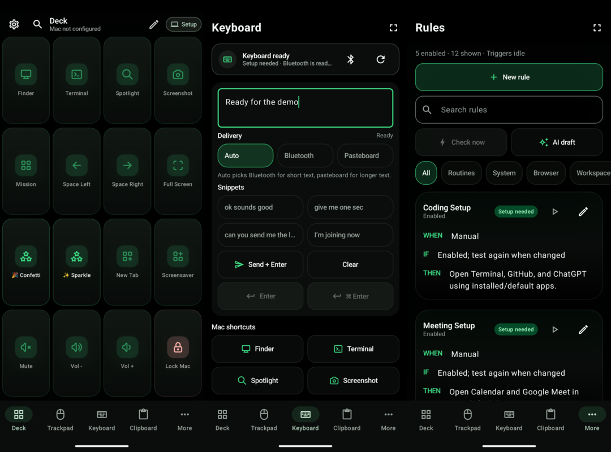
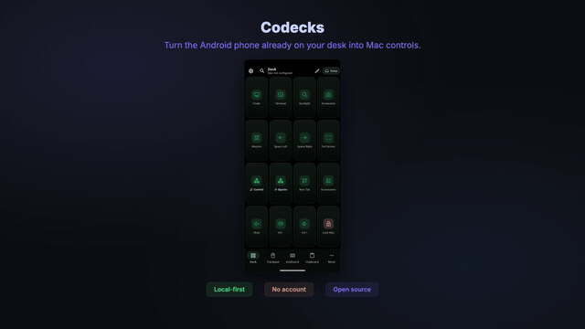

# Codecks

Turn an Android phone, tablet, or Samsung DeX window into a local-first command deck, trackpad, and automation surface for your Mac.

[](LICENSE)
[](app/build.gradle.kts)
[](app/build.gradle.kts)
[](PRIVACY.md)



## Demo



[Watch the narrated 1080p feature tour](docs/images/codecks-demo.mp4).

## Why It Exists

Mac shortcuts are fast until you need the command you never remember. Codecks gives you a second-screen control surface: big command keys, a Bluetooth trackpad, and reviewable automations that stay local by default.

## Highlights

- **Command deck and editor:** run Finder, Terminal, Spaces, media,
  screenshot, browser, and custom Mac actions from resizable buttons.
- **Trackpad:** Bluetooth HID pointer controls with gestures, scrolling,
  haptics, rotation, fullscreen, and an optional restricted lockscreen surface.
- **Keyboard:** send text and explicit Enter or Command+Enter; short text can
  use Bluetooth while longer or Unicode text can use Mac clipboard paste.
- **Clipboard bridge:** manually push or pull text, or enable visible
  directional sync with conflict handling.
- **Rules:** local When / If / Then recipes with safe templates,
  test-before-enable, approval where required, and run history.
- **Find and build:** search actions and Rules in Command Palette; optionally
  ask an AI provider to draft disabled buttons, decks, and Rules for review.
- **Desk-ready entry:** open `codecks://trackpad` from a widget, notification,
  NFC, or a Tasker desk-position profile.
- **Adaptive and recoverable:** phone, tablet, landscape, freeform, and Samsung
  DeX layouts; local Deck and Rules backup excludes secrets.
- **No hosted account:** no Codecks backend, analytics SDK, advertising SDK, public database, or cloud sync.

See the [feature guide](docs/product/FEATURE_GUIDE.md) for what each feature is
for, required setup, limitations, experimental boundaries, and deferred work.

## Safety Model

Codecks can run commands on a Mac you configure, so the app is built around review and restraint:

- built-in templates use an allowlist;
- dangerous shell patterns are blocked;
- generated automations are disabled until the user tests and enables them;
- SSH host keys are pinned;
- optional AI API keys are encrypted with Android Keystore;
- diagnostic text is redacted before display.

Use a non-admin Mac account and review every custom command before enabling it. See [Security](SECURITY.md) and [Privacy](PRIVACY.md).

## Install

Download the signed APK and `SHA256SUMS.txt` from the [latest GitHub release](https://github.com/vaddisrinivas/codecks/releases/latest). Android may ask you to allow installation from your browser or file manager.

Requirements:

- Android 9 or newer.
- macOS with Remote Login enabled for Deck and Automations.
- A compatible paired Bluetooth host for HID Trackpad controls.

## Build

```bash
git clone https://github.com/vaddisrinivas/codecks.git
cd codecks
./gradlew :app:testDebugUnitTest :app:lintDebug :app:assembleDebug
```

Debug APK:

```text
app/build/outputs/apk/debug/app-debug.apk
```

Release signing instructions live in [docs/release/RELEASING.md](docs/release/RELEASING.md).

## Project Status

`v0.1.32` is the current public beta. Core deck, trackpad, keyboard, explicit clipboard transfer, staged automation proof, editing, settings, optional AI-assisted drafting, default-off Smart/Reactive foundations, and experimental Reactive Mac-helper infrastructure are implemented in the single signed APK. Broader physical-device coverage, TalkBack validation, live helper pairing validation, real Samsung DeX acceptance, and longer crash-free field testing remain GA gates. See the [production launch plan](docs/release/PRODUCTION_LAUNCH_PLAN.md).

## FOSS Distribution

Codecks is Apache-2.0, source-available, account-free, and prepared for FOSS directory review. Distribution notes and anti-feature disclosures are tracked in [docs/distribution/FOSS_READINESS.md](docs/distribution/FOSS_READINESS.md). Fastlane/IzzyOnDroid metadata lives in [fastlane/metadata/android/en-US](fastlane/metadata/android/en-US).

## Use the screen already beside your computer

Phones are already common equipment: Pew's representative 2025 survey found
91% of U.S. adults owned a smartphone.[^pew-ownership] Direct placement
research is thinner. A 2022 study of 356 men in Melbourne found 54% often or
very often left their phone on a table or desk indoors when it was not in
use.[^phone-placement] That supports the idea, but it is not a global estimate
of phones sitting beside computers.

Codecks turns that existing screen into a Bluetooth trackpad and command
surface. A 2025 global market estimate puts the average computer-mouse selling
price near $38; standard mousepads are estimated at $5–$15.[^hardware-market]
That makes **about $38** the mouse-only benchmark and **$43–$53** when a
standard pad would also be purchased, before tax and shipping. These are
avoided-new-hardware estimates—not promised savings or the value of equipment
already owned.

A common medium-to-large pad occupies about **153–279 square inches**.[^pad-size]
Against IBM's 48×24-inch minimum and 60×30-inch recommended individual
work-surfaces, that is roughly **9%–24% of the desktop**.[^work-surface] Space
is especially relevant outside dedicated offices: 2024 UK survey data,
published in 2026, found 59% of 2,543 home workers used a shared office, a
corner workstation, or space intended for another purpose.[^home-workspace]

A 2026 U.S. market estimate puts the average compact writing desk at
**$170–$190**.[^desk-market] Spread across IBM's work-surface range, that is an
estimated **$0.09–$0.16 per square inch**, making the 153–279-square-inch pad
area worth roughly **$14–$46 in allocated desk cost**. This is not cash
recovered: it values the fraction of a desk purchase represented by that
surface. The direct economic benchmark remains an optional $38 mouse-only or
$43–$53 mouse-plus-pad purchase avoided.

## Tradeoffs

- Initial pairing and minor setup are required. Deck and automation commands
  also require a configured Mac connection.
- A touchscreen trackpad does not feel identical to a dedicated mouse. Pointer
  speed, tap thresholds, gestures, and muscle memory may need adjustment.
- Bluetooth, Android background rules, lockscreen behavior, and vendor power
  management can affect availability.
- The phone remains occupied while used as a full-screen trackpad.
- A 2025 desk-work experiment found participants interacted with a phone almost
  three times as often when it was within reach; Codecks may therefore increase
  distraction for some people.[^phone-proximity]
- Codecks does not claim ergonomic superiority over a physical mouse. Use
  whichever input method is more comfortable for the task.

## Contributing

Bug reports, device compatibility notes, accessibility findings, and safe automation templates are welcome. Start with [CONTRIBUTING.md](CONTRIBUTING.md).

## License

Codecks is available under the [Apache License 2.0](LICENSE). Third-party Android libraries retain their own licenses; in-app notices are generated from `app/src/main/assets/open_source_notices.txt`.

Codecks is an independent project. It is not affiliated with OpenAI, Toggl, Work Louder, Samsung, Google, or Apple.

[^phone-placement]: Zeleke et al., ["Mobile phone carrying locations and risk perception of men," PLOS ONE 17(6)](https://doi.org/10.1371/journal.pone.0269457). Cross-sectional convenience sample collected in Melbourne in 2018–2019; the authors state it is not representative of all Australian men.
[^pew-ownership]: Pew Research Center, ["Mobile Fact Sheet"](https://www.pewresearch.org/internet/fact-sheet/mobile/), based on a representative survey of 5,022 U.S. adults conducted February 5–June 18, 2025.
[^hardware-market]: Dataintelo, ["Computer Mouse Market Research Report 2034"](https://dataintelo.com/report/computer-mouse-market) and ["Mousepad Market Research Report 2034"](https://dataintelo.com/report/mousepad-market). These are commercial market-research estimates, not audited transaction data; the mouse figure is market-wide while the pad range is for the standard segment.
[^pad-size]: [Razer Gigantus V2 size table](https://www.razer.com/gaming-mouse-mats/razer-gigantus-v2): Medium 14.17×10.83 inches and Large 17.72×15.73 inches. Product examples establish footprint, not market share.
[^work-surface]: [IBM Workplace Design – Individual](https://www.ibm.com/design/workplace/space-types/individual/approach/): 48×24 inches minimum and 60×30 inches recommended for sit-stand desks.
[^desk-market]: IndexBox, ["Compact Writing Desk Market in the United States"](https://www.indexbox.io/store/united-states-kw-compact-writing-desk-840-market-analysis-forecast-size-trends-and-insights/), estimates a $170–$190 average retail unit price in 2026 using retail-scanner data and trade-shipment estimates. This is the closest public category proxy found, not audited transaction data for every U.S. desk type.
[^home-workspace]: Felstead, ["The Spatial Anatomy of Working at Home," Industrial Relations Journal (2026)](https://orca.cardiff.ac.uk/id/eprint/184858/1/Industrial%20Relations%20Journal%20-%202026%20-%20Felstead%20-%20The%20Spatial%20Anatomy%20of%20Working%20at%20Home%20Concepts%20Measures%20and%20Types%20of.pdf), using weighted Skills and Employment Survey 2024 data. Of 2,543 UK home workers, 41.1% reported their own office.
[^phone-proximity]: Heitmayer, ["When the phone's away, people use their computer to play," Frontiers in Computer Science (2025)](https://doi.org/10.3389/fcomp.2025.1422244). Within-participant laboratory study, final sample 22; it found no increase in total time spent working when the phone was farther away.
